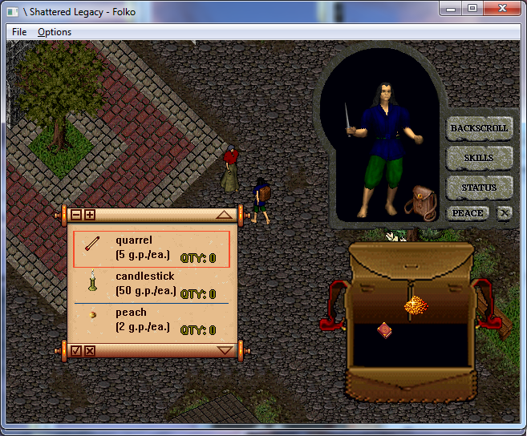

# UOSL

[Ultima Online: Shattered Legacy](http://www.moongates.com/History/History_UO1.htm) (UOSL) is the pre-alpha version of Ultima Online from 1996. UOSL is the first graphical Internet MMORPG.

This repository contains the following projects:

* libuosl: a library to access the data formats of the original client. It can retrieve graphics, sounds, map information and everything else needed to implement a server or client for UOSL.
* ViewSL: an application that uses libuosl to browse the client data files, e.g. for viewing ingame scenes, listening to sounds, searching for graphics by name and other features.
* SLClient: a custom client implementation that uses the original client data files through libuosl. Rendering is done using OpenGL 3.2.
* JPhex: a server emulator for UOSL. It can be used with both the original client and SLClient. Behavior of items, spells and NPCs can be changed at runtime using Ruby scripts.

## Project Status

* libuosl: mature, can read all of the client's data files and almost every field in all data types is known and supported
* ViewSL: mature, can view most of the client's data files
* JPhex: beta, has support for all game mechanics but not all scripts are implemented, e.g. some items are missing and the NPCs are not very smart yet
* SLClient: pre-alpha, I'm mainly doing experiments and prototypes here, especially the rendering is very slow because I'm currently focused on other parts

